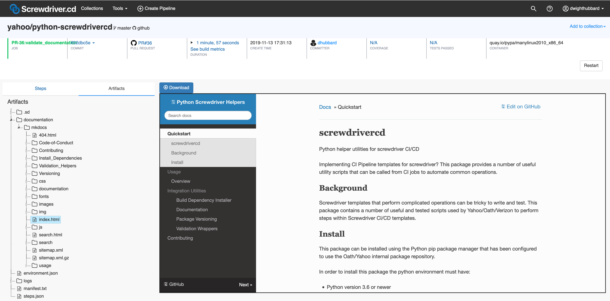

## Package Documentation Publisher

The screwdrivercd_documentation tool is an extensible tool to publish documentation to github pages from multiple
formats.

### Rationale

This allows for simple templates that can generate and publish documentation published to github pages in multiple 
formats.  This utility in addition to generating and publishing the documentation handles CI/CD operations such as
cleanly handling errors and ensuging the logs and generated content is in the CI Pipeline build artifacts so they
can be inspected.

### screwdrivercd_documentation usage

Unlike most other screwdrivercd command line utilities, this utility can be used without having a python code package 
in the current repository. 

This utility will look for both `mkdocs` and `sphinx` documentation configuration files and generate documentation 
using all the tools it finds configuration files for.

If using `mkdocs`:

 - This template will look for the `mkdocs.yml` in the root of the repository and inside the `docs` directory.

If using `sphinx`:

 - This template will look for the sphinx `conf.py` file `doc/source` directory of the repository.

### Settings
The follow environment variables can be used to tune the behavior of the utility.

| Setting               | Default Value             | Description                                             |
| --------------------- | ------------------------- | ------------------------------------------------------- |
| DOCUMENTATION_DEBUG   | False                     | Turn on debug logging when generating the documentation |
| DOCUMENTATION_FORMATS | mkdocs,sphinx             | Type of documentation to generate                       |
| DOCUMENTATION_PUBLISH | True                      | Publish the generated documentation to github pages     |

### Artifacts

The build artifacts are generated even if the documentation is not published.  This allows a Pull Request to generate
documentation that can be inspected in the build artifacts of the job.

To assist in troubleshooting issues, the logs are always stored in the build artifacts, even if the documentation 
generation fails. 

| Path                    | Description |
| ----------------------- | ----------- |
| documentation/mkdocs    | The documentation generated by running the mkdocs command. |
| documentation/sphinx    | The documentation generated by running the sphinx command. |
| logs/mkdocs             | Directory containing the logs from the mkdocs build and publish. |
| logs/sphinx             | Directory containing the logs from the sphinx build and publish. |

The generated documentation is written into the build artifacts in the `documentation/{tool}` directory.

So, documentation built using the [mkdocs]() tool will be found in the build artifacts in the `documentation/mkdocs`
directory.  

!!! note

    While the generated documentation content can be viewed in the screwdriver artifacts, screwdriver does not
    does not serve css and javascript for the documents so while content can easily be viewed aspects of the
    theme of the content will likely not be fully visible.

The logs from generating the documentation are stored in the build_artifacts in the `logs/{tool}` directory.

Here is an example of the artifacts from a build of documentation using the mkdocs tool:

